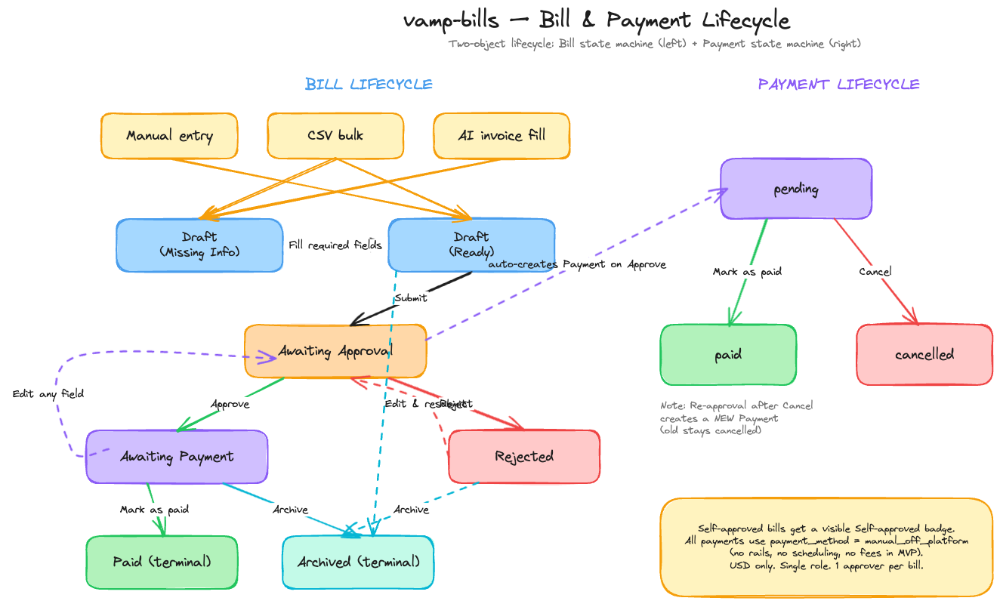

# vamp-bills — MVP Scope

A Bill Pay-style accounts payable product, scoped to demo within take-home time budget. Modeled on Ramp Bill Pay; deliberately narrower.

## What we're building (one-paragraph version)

A single-tenant AP app where users create bills (manually, via CSV bulk, or by uploading an invoice image/PDF that an AI vision model parses into form fields), route them through a single per-bill approver, then mark them as paid once the payment has been made out-of-band. Vendors are simple records owned by users. Currency is USD only. The entire payment surface is "manual / paid off-platform" — no rails, no scheduling, no fees.

---

## Lifecycle at a glance



> Source: [`diagrams/bill-payment-lifecycle.excalidraw`](diagrams/bill-payment-lifecycle.excalidraw) — open in [excalidraw.com](https://excalidraw.com/) to edit.

---

## Design principles

1. **Convergent intake.** Three different ways to create a bill, all landing on the same `Draft` artifact. No branching pipelines downstream.
2. **Two-object lifecycle.** A `Bill` and a `Payment` are separate entities with linked-but-independent state machines, mirroring Ramp's product model. Even though MVP only ever has one Payment per Bill of one method (manual), the schema supports 1:N from day one.
3. **Manual everywhere money moves.** No bank connection, no payment rails, no scheduler. The user pays the vendor however they want and comes back to record it. This eliminates ~70% of the surface area Ramp covers.
4. **Honest single-user demo.** Single role; per-bill approver selection allows self-approval but flags it with a visible "Self-approved" badge so the separation-of-duties intent is preserved as a documented MVP compromise.

---

## In scope

### Intake (3 methods → all produce Drafts)

| Method | What it does |
|---|---|
| **Manual entry** | Empty bill form, user fills all fields by hand. |
| **CSV bulk upload** | Spreadsheet upload, one row per bill. Maps columns to bill fields, creates N drafts in one action. |
| **AI invoice fill** | User uploads an invoice (image or PDF). A vision-capable LLM extracts vendor, invoice number, dates, amounts, line items into the form. **File is upload-and-discard** — used for extraction only, not stored. User reviews/edits before saving. |

### Bill entity

| Field | Required | Notes |
|---|---|---|
| `vendor_id` | ✓ | FK → vendors |
| `invoice_number` | ✓ | Free text, unique per vendor (soft-uniqueness, surface a warning if duplicate) |
| `total_amount` | ✓ | Decimal, must equal sum of line items |
| `currency` | ✓ | Constant `'USD'` for MVP |
| `invoice_date` | ✓ | Date the invoice was issued |
| `due_date` | optional | Used for sort/filter; bill saves without it |
| `description` | ✓ | Free-text memo |
| `approver_id` | ✓ | FK → users; selected at creation |
| `line_items[]` | ✓ | ≥1 line; each `{description, amount}` |
| `status` | ✓ | enum (see lifecycle) |
| `created_by` | ✓ | FK → users |
| `created_at` / `updated_at` | ✓ | timestamps |

> **Implementation notes (schema PR, [`packages/backend/src/db/app-schema.ts`](../packages/backend/src/db/app-schema.ts)):**
> - The persisted `status` enum is `draft | awaiting_approval | approved | rejected | paid | archived`. The `Draft (Missing Info)` vs `Draft (Ready)` split is **derived** from required-field completeness at query/render time, not stored — keeps the enum honest. `approved` is the same persisted state the lifecycle calls "Awaiting payment" (per the diagram note above).
> - `currency` is stored as a `text` column with default `'USD'` (not a constant) so future multi-currency doesn't require a migration.
> - `invoice_number` uniqueness per vendor is **soft** — enforced in the bill-create mutation as a warning UX, not via a DB unique constraint. A composite `(vendor_id, invoice_number)` index supports the dup-check query.
> - `total_amount == sum(line_items.amount)` is enforced in the bills mutation (single transaction), not via a DB constraint or trigger.
> - All FKs to `vendors` and `user` are `ON DELETE RESTRICT` (deleting either is rejected while bills reference it). FKs from `bill_line_items` and `payments` to `bills` are `ON DELETE CASCADE`.

### Vendor entity

| Field | Required | Notes |
|---|---|---|
| `name` | ✓ | |
| `email` | ✓ | For potential future "remind vendor" flow; not used in MVP for actual sends |
| `created_at` / `updated_at` | ✓ | |

### Payment entity (1:N from Bill)

| Field | Required | Notes |
|---|---|---|
| `bill_id` | ✓ | FK → bills |
| `amount` | ✓ | = bill.total_amount in MVP (splits later) |
| `status` | ✓ | enum: `pending` / `paid` / `cancelled` |
| `payment_method` | ✓ | enum: `manual_off_platform` (only value for MVP, ready to extend) |
| `paid_at` | optional | Set when status → `paid` |
| `reference` | optional | Free-text note ("Zelle conf #abc", "Wire ref 12345") |
| `created_at` / `updated_at` | ✓ | |

### User entity

| Field | Required |
|---|---|
| `id`, `name`, `email` | ✓ |

Single role. No permissions matrix in MVP.

### Lifecycle (state machine)

**Bill states**

```
                  Manual / CSV / AI-fill
                            │
                            ▼
                         DRAFT
                        /     \
                Missing Info   Ready
                       \        /
                    (user edits to fill required fields)
                            │
                            ▼
                  Awaiting approval ◀──────┐
                       /        \           │
                  Approved    Rejected ─────┘
                      │       (Edit & resubmit)
                      │
                      ▼
                Awaiting payment ─── Edit any field ──▶ back to Awaiting approval
                   ▲  │
        Cancel ────┘  ▼
                   ┌──────────────┐
                   │              │
                   ▼              ▼
                  Paid         Archived
            (Mark as paid)    (terminal)
```

**Bill state transitions**

| From | To | Trigger |
|---|---|---|
| — | `Draft (Missing Info)` | Created via AI-fill or CSV with gaps |
| — | `Draft (Ready)` | Created via Manual or AI-fill/CSV with all required fields |
| `Draft (Missing Info)` | `Draft (Ready)` | User fills in remaining required fields |
| `Draft (Ready)` | `Awaiting approval` | User submits |
| `Awaiting approval` | `Approved` | Approver clicks Approve |
| `Awaiting approval` | `Rejected` | Approver clicks Reject |
| `Awaiting approval` | `Archived` | Creator clicks Archive (pull-the-plug on a pending-review bill; deliberate machine deviation from the spec ribbon — surface via overflow menu) |
| `Rejected` | `Awaiting approval` | User clicks Edit & resubmit |
| `Approved` (i.e. `Awaiting payment`) | `Awaiting approval` | User edits *any* field on the bill |
| `Awaiting payment` | `Paid` | User clicks Mark as paid |
| `Awaiting payment` | `Archived` | User clicks Archive |
| `Paid` | `Awaiting payment` | User clicks Cancel on a paid bill |
| `Paid` | `Archived` | User clicks Archive on a paid bill |
| `Draft` / `Rejected` | `Archived` | User clicks Archive |
| `Archived` | (terminal) | — |

> **Edit-restarts-approval rule.** Any edit on a non-terminal bill (regardless of which field) returns it to `Awaiting approval`. Single rule, no per-field logic — keeps the model honest and the implementation trivial.

**Payment state transitions**

A Payment is created when the user clicks Mark as paid on an approved bill. The `pending` enum value is reserved in the schema for future scheduled-payment work but is not exercised in the MVP — bills transition straight from `Approved` to `Paid`, with the Payment row inserted at status `paid` in the same transaction.

| From | To | Trigger |
|---|---|---|
| — | `paid` | User clicks Mark as paid (Bill: Approved → Paid; Payment row inserted) |
| `paid` | `cancelled` | User clicks Cancel on a paid bill (Bill: Paid → Approved; Payment row marked cancelled) |

> **Cancel vs. Archive.** Cancel reverts a *paid* bill back to `Awaiting payment` and marks the Payment row `cancelled` — useful if the user marked-paid by mistake or changed their mind. The bill becomes payable again; calling Mark as paid a second time inserts a fresh Payment row (the cancelled one stays as audit trail). Archive closes the bill terminally; if it was paid, the Payment row stays `paid` since the bill genuinely was paid before being archived.

### UI surfaces

> **Implementation note (App Shell PR):** the chrome — collapsible sidebar
> + breadcrumb header + outlet — is wired in
> [`packages/frontend/src/components/app-shell/`](../packages/frontend/src/components/app-shell/)
> and mounted via the pathless `_app` layout route in
> [`packages/frontend/src/routes/_app.tsx`](../packages/frontend/src/routes/_app.tsx).
> `/` redirects to `/bills`. The Bills surface itself (tabs, filters, table)
> ships in a follow-up PR.

**Bills list page** (the main view)
- 4 tabs across the top, each a pre-baked status filter:
  - `Drafts` (Missing Info + Ready)
  - `Awaiting approval`
  - `Awaiting payment`
  - `History` (Paid + Archived)
- Per-tab filters: vendor, due date range, amount range
- Sort by clicking column headers: due date, amount, vendor
- Free-text search across vendor name + invoice number
- Primary action: **New bill** button → opens intake chooser (Manual / CSV / Upload invoice)

**Bill detail page**
- Form view of all fields, editable in non-terminal states
- Line items rendered as a list (add/remove rows, totals must reconcile)
- "Self-approved" badge if `approver_id == created_by`
- State-appropriate primary actions in the top-right:
  - Draft: `Submit for approval` (disabled if Missing Info), `Archive`
  - Awaiting approval: `Approve`, `Reject` (visible to approver only)
  - Rejected: `Edit & resubmit`, `Archive`
  - Awaiting payment: `Mark as paid`, `Archive`, `Edit` (returns to Awaiting approval)
  - Paid: `Cancel` (reverts Paid → Awaiting payment, marks Payment cancelled), `Archive`
  - Archived: read-only

**Vendors page**
- Simple CRUD list + form (name, email)

**Settings / user switcher** (for demo only)
- A "View as" dropdown if you choose to seed multiple users (otherwise skip)

### API surface (tRPC)

All bill / vendor / payment procedures are behind `protectedProcedure`
(BetterAuth session required). The one exception is `health`, which stays
on `publicProcedure` so uptime probes don't need a session cookie.
Three sub-routers mounted on `appRouter`:

- **`vendors`** — `list`, `getById`, `create`, `update` (any authenticated user can read or mutate; no per-tenant scoping in the demo).
- **`bills`** — `list` (status + scope filters), `getById`, `create`, `update`, plus one mutation per `BillEvent` (`submit`, `approve`, `reject`, `markPaid`, `cancelPayment`, `archive`, `edit`). Lifecycle mutations call `attemptTransition` first; only the bill's `createdBy` may submit/edit/markPaid/cancelPayment/archive, and only its `approverId` may approve/reject. Wrong actor → `FORBIDDEN`; wrong state → `BAD_REQUEST`; readiness guard fails → `BAD_REQUEST` with `error.data.missingPaths` (lifted by the `errorFormatter` from a `GuardFailedError` cause).
- **`payments`** — `listForBill` (read-only). Payment mutations happen as side effects of `bills.markPaid` / `bills.cancelPayment`.

`getById` and every lifecycle mutation return the same hydrated bill shape: `{ bill, lineItems, payment, availableEvents, missingPaths }`. The FE never re-derives the action ribbon or the "what's blocking submit?" list — those flow off this single response.

### Demo plan

A 3-minute happy-path walkthrough:

1. **Create via AI-fill** — drag a sample invoice PDF onto the New Bill page. Watch the form populate in ~5 seconds. Edit one line item. Save as draft.
2. **Show CSV bulk** — upload a small CSV (3-5 rows). All appear in the Drafts tab.
3. **Submit for approval** — pick approver (yourself for the demo, with the Self-approved badge highlighted as an honest tradeoff).
4. **Approve** — view in the Awaiting approval tab, click Approve.
5. **Mark as paid** — add a reference note ("Wired via Mercury, ref 12345"), click Mark as paid. Bill moves to History.
6. **Show the lifecycle** — open a different bill in Awaiting payment, edit the amount, point out it returned to Awaiting approval. Approve again, Archive instead of paying. Show in History.

---

## Out of scope (with rationale)

| Feature | Why cut |
|---|---|
| **AP email forwarding** (`*@ap.ramp.com`) | Requires real inbox + email parsing infra. Out-of-band setup, low demo value. |
| **Vendor Network** (vendor-side invoice push) | Whole second product surface (vendor accounts, portal, auth). |
| **Recurring bills** | Requires a scheduler + spawned-bill semantics. Most code for least demo impact. Stretch goal. |
| **Payment rails** (ACH, RTP, card, check, wire, SWIFT, FX) | Each is a multi-week integration. Manual covers all use cases for demo purposes. |
| **Payment scheduling / "scheduled" status** | No rails to schedule against. |
| **Payment failed / retry** | No payment to fail. |
| **Payment release / separation of duties** | Ramp Plus feature; complex policy engine. |
| **Partial payments** | Beta even at Ramp. Complex bill-paid-when-all-payments-paid logic. |
| **Smart OCR / auto-coding agent** | Vendor-specific learning loop is its own product. Basic vision-LLM extraction is enough. |
| **Waiting for vendor** state | No vendor-side request mechanism, so this state has no entry point. Collapses cleanly into Missing Info. |
| **Waiting for match** state | Card-payment-specific (single-use Ramp card). No card payments. |
| **ERP / accounting sync** (NetSuite, QBO, Sage, Xero) | Each is a discrete integration. |
| **Multi-currency / FX** | Triggers per-currency formatting, FX rates, conversion. USD-only constant. |
| **Multi-entity** | Org structure complexity for no demo value. |
| **AP Aging report** | Pure list rendering on top of due_date; can add later in 30 min if asked. |
| **File attachments** (post-OCR storage, Email slot, Files slot) | No blob storage, no file viewer. AI-fill uploads are discarded after extraction. |
| **Activity log / audit trail** | Demo could show this but not core; cuttable for time. |
| **Notifications** (email, Slack, in-app inbox) | No notification infra. Approvers check their queue. |
| **Roles & permissions** (Admin / Bookkeeper / AP Clerk / Vendor Owner / etc.) | Single role; per-bill approver picker covers the only authorization decision. |
| **Vendor credits / credit memos** | Reduces bill total — interacts with Payment model. Future scope. |
| **Tax** (W-9 storage, 1099 export) | Vendor-tax sub-product. Out. |
| **Line item splits / allocation templates** | One amount per line; no proration. |
| **Expense vs. item distinction** | ERP integration concept — irrelevant without ERP. |
| **Saved views, column reordering, bulk export** | UI polish features; cuttable. |

---

## Open questions for the build phase

- Tech stack (frontend framework, backend, DB, hosting)
- AI vision provider for invoice extraction (Anthropic, OpenAI, Google) — pick one
- Auth approach (real auth vs. seeded-user dropdown)
- Test coverage budget
- Deployment target (Vercel, Fly, local-only with screen recording)
